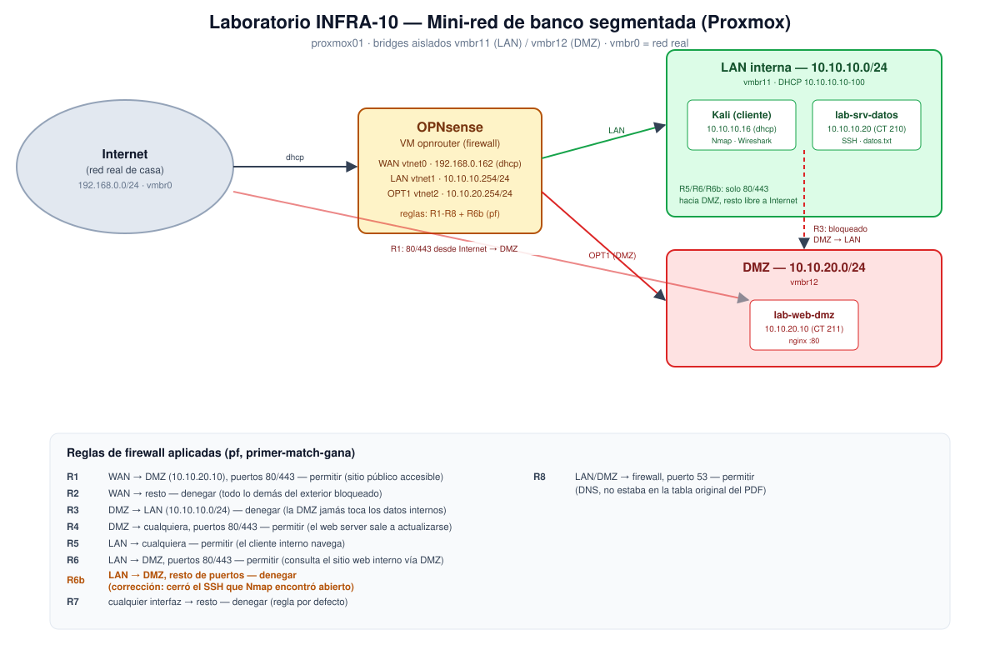

# Actividad 10 — Laboratorio Paso a Paso: mini-red de banco segmentada

Construye una red de tres zonas (LAN interna, DMZ, Internet) separadas por
un firewall, siguiendo `10-Laboratorio-Paso-a-Paso.pdf`, adaptado de
VirtualBox a un hipervisor Proxmox real (`proxmox01`).

## Topología final

```
LAN interna   10.10.10.0/24   (vmbr11) — servidor de datos .20, cliente Kali
DMZ           10.10.20.0/24   (vmbr12) — servidor web .10
WAN           red real de casa, DHCP    (vmbr0)
Firewall      OPNsense (VM opnrouter)  — WAN .254(dhcp) / LAN 10.10.10.254 / DMZ 10.10.20.254
```



Detalle completo de la construcción, comandos usados y desviaciones
respecto al PDF original en [bitacora.md](bitacora.md). Informe ejecutivo
con marco normativo y hallazgos en [informe.md](informe.md).

## Evidencias (`evidencias/`)

| Archivo | Contenido |
|---|---|
| `EVI-2026-09-02-01-reglas-firewall-opnsense.txt` | `pfctl -sr` — reglas cargadas antes de corregir el hallazgo |
| `EVI-2026-09-02-02-reglas-firewall-opnsense-final.txt` | `pfctl -sr` — estado final, con la corrección `R6b` |
| `EVI-2026-09-02-03-nmap-dmz.png` | Prueba D: `nmap -sP` y `nmap -sS` contra la DMZ |
| `EVI-2026-09-02-04-wireshark-http.png` | Captura de tráfico HTTP (GET/200 OK) |
| `EVI-2026-09-02-05-wireshark-icmp.png` | Captura de tráfico ICMP (ping cliente → web DMZ) |
| `EVI-2026-09-02-06-navegador-web-dmz.png` | Página del servidor web de la DMZ, con fecha |
| `EVI-2026-09-02-07-reglas-opt1-gui.png` | Reglas de firewall de la interfaz OPT1 (DMZ), vista GUI |
| `EVI-2026-09-02-08-reglas-lan-gui.png` | Reglas de firewall de la interfaz LAN, vista GUI |
| `EVI-2026-09-02-09-diagrama-laboratorio.svg` | Diagrama del laboratorio (topología, zonas, reglas) |

## Hallazgo del ejercicio

Nmap detectó el puerto SSH de la DMZ abierto hacia la LAN (no debía
estarlo). Causa y corrección documentadas en `bitacora.md`, sección 5.
